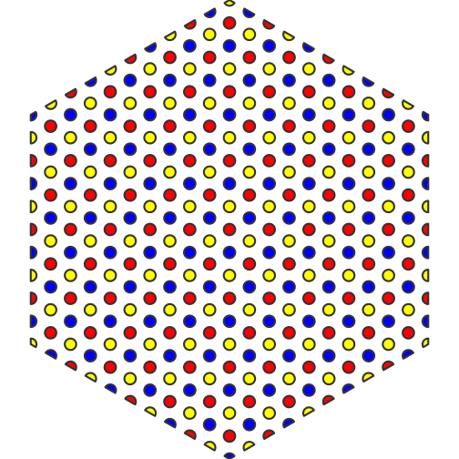
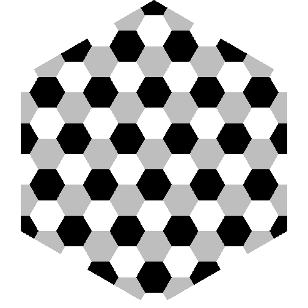
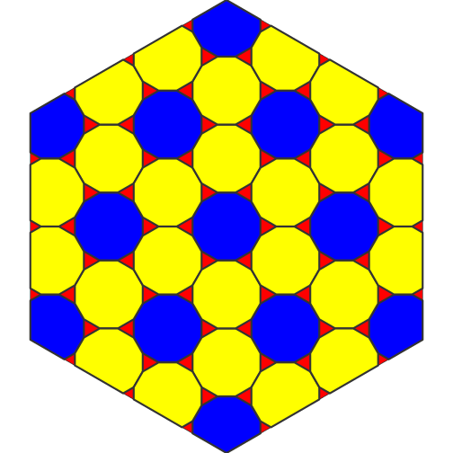
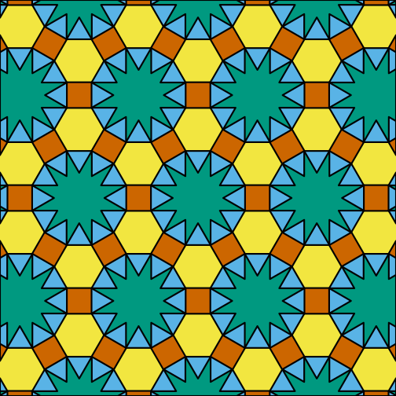
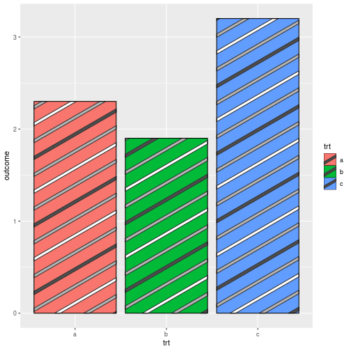
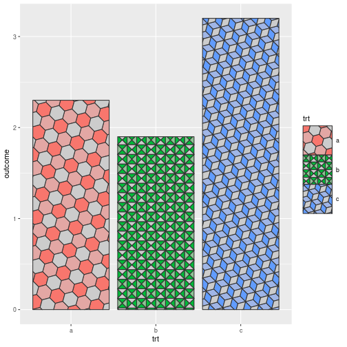

# gridpattern 

[](https://cran.r-project.org/package=gridpattern)
[](https://travis-ci.org/trevorld/gridpattern)
[](https://ci.appveyor.com/project/trevorld/gridpattern)
[](https://codecov.io/github/trevorld/gridpattern?branch=main)

### Table of Contents

* [Overview](#overview)
* [Installation](#installation)
* [Examples](#examples)
* [Using these patterns with the "ggpattern" package](#ggpattern)

## <a name="overview">Overview</a>

`gridpattern` provides [grid.pattern()](http://trevorldavis.com/R/gridpattern/dev/reference/grid.pattern.html) and
[patternGrob()](http://trevorldavis.com/R/gridpattern/dev/reference/grid.pattern.html)
functions to use with R's grid graphics system. They fill in a
user-specified boundary path with a user-specified pattern. These pattern grobs include
enhanced versions of the patterns originally contained within 
[Mike FC](https://github.com/coolbutuseless)'s awesome
[ggpattern](https://github.com/coolbutuseless/ggpattern) package 
(which provides patterned ``ggplot2`` "geom" functions but 
[does not provide exported access to the underlying grobs](https://github.com/coolbutuseless/ggpattern/issues/11) themselves) as well as completely new "polygon_tiling", "regular_polygon", and "weave" patterns.

`{gridpattern}` currently provide `{grid}` grob support for the following patterns:

1.  [ambient](https://trevorldavis.com/R/gridpattern/dev/reference/grid.pattern_ambient.html):
    noise array patterns powered by the [ambient](https://cran.r-project.org/package=ambient) package
2.  [circle](https://trevorldavis.com/R/gridpattern/dev/reference/grid.pattern_circle.html): circle geometry patterns
3.  [crosshatch](https://trevorldavis.com/R/gridpattern/dev/reference/grid.pattern_crosshatch.html): crosshatch geometry patterns
4.  [gradient](https://trevorldavis.com/R/gridpattern/dev/reference/grid.pattern_gradient.html): gradient array patterns
5.  [image](https://trevorldavis.com/R/gridpattern/dev/reference/grid.pattern_image.html): image array patterns
6.  [magick](https://trevorldavis.com/R/gridpattern/dev/reference/grid.pattern_magick.html): imagemagick array patterns
7.  none (equivalent to `grid::null()`)
8.  [placeholder](https://trevorldavis.com/R/gridpattern/dev/reference/grid.pattern_placeholder.html): placeholder image array patterns
9.  [plasma](https://trevorldavis.com/R/gridpattern/dev/reference/grid.pattern_plasma.html): plasma array patterns
11. [polygon_tiling](https://trevorldavis.com/R/gridpattern/dev/reference/grid.pattern_polygon_tiling.html): polygon tiling patterns
11. [regular_polygon](https://trevorldavis.com/R/gridpattern/dev/reference/grid.pattern_regular_polygon.html): regular polygon geometry patterns
12. [stripe](https://trevorldavis.com/R/gridpattern/dev/reference/grid.pattern_stripe.html): stripe geometry patterns
13. [weave](https://trevorldavis.com/R/gridpattern/dev/reference/grid.pattern_weave.html): weave geometry patterns
14. [custom ggpattern geometry-based patterns](https://coolbutuseless.github.io/package/ggpattern/articles/developing-patterns-2.html)
15. [custom ggpattern array-based patterns](https://coolbutuseless.github.io/package/ggpattern/articles/developing-patterns-3.html)

## <a name="installation">Installation</a>

To install the development version use the following command in R:


```r
remotes::install_github("trevorld/gridpattern")
```

## <a name="examples">Examples</a>


```r
library("ambient")
library("grid")
library("gridpattern")
x_hex <- 0.5 + 0.5 * cos(seq(2 * pi / 4, by = 2 * pi / 6, length.out = 6))
y_hex <- 0.5 + 0.5 * sin(seq(2 * pi / 4, by = 2 * pi / 6, length.out = 6))
```


```r
grid.pattern_circle(x_hex, y_hex, density = 0.5, grid = "hex_circle",
                    fill = c("blue", "yellow", "red"))
```



```r
grid.pattern_regular_polygon(x_hex, y_hex, shape = c("convex4", "star8", "circle"),
                             colour = "black", fill = c("blue", "yellow", "red"), 
                             density = c(0.45, 0.42, 0.4), spacing = 0.08, angle = 0)
```


```r
grid.pattern_regular_polygon(x_hex, y_hex, shape = "convex6", grid = "hex",
                             color = "transparent", fill = c("white", "grey", "black"),
                             density = 1.0, spacing = 0.1)
```



```r
grid.pattern_weave(x_hex, y_hex, type = "satin", 
             colour = "black", fill = "lightblue", fill2 =  "yellow",
             density = 0.3)
```


```r
gp <- gpar(fill = c("yellow", "red", "blue"))
grid.pattern_polygon_tiling(x_hex, y_hex, type = "truncated_hexagonal", 
                            spacing = 0.15, gp = gp)
```



```r
blue <- grDevices::rgb(0.35, 0.70, 0.90)
yellow <- grDevices::rgb(0.95, 0.90, 0.25)
red <- grDevices::rgb(0.80, 0.40, 0.00)
green <- grDevices::rgb(0.00, 0.60, 0.50)
grid.rect(gp = gpar(fill = yellow, col = NA))
gp <- gpar(fill = red, col = "black")
grid.pattern_stripe(grid = "hex_circle", density = 0.25, spacing = 0.3, 
                    angle = 0, gp = gp)
grid.pattern_stripe(grid = "hex_circle", density = 0.25, spacing = 0.3, 
                    angle = -60, gp = gp, yoffset=-0.110)
grid.pattern_stripe(grid = "hex_circle", density = 0.25, spacing = 0.3, 
                    angle = 60, gp = gp, yoffset=0.068)
gp <- gpar(fill = blue, col = "black")
grid.pattern_regular_polygon(shape = "convex12", grid = "hex_circle", rot = 15,
                             density = 0.82, spacing = 0.3, angle = 0, gp = gp)
gp <- gpar(fill = green, col = "black")
grid.pattern_regular_polygon(shape = "star12", grid = "hex_circle", rot = 15,
                             density = 0.82, spacing = 0.3, angle = 0, gp = gp,
                             scale = 0.55)
```



## <a name="ggpattern">Using these patterns with the "ggpattern" package</a>

The patterns provided by ``gridpattern`` can be used to create [custom ggpattern geometry-based patterns](https://coolbutuseless.github.io/package/ggpattern/articles/developing-patterns-2.html).  

Here is an example of creating a new  "multicolor_stripe" pattern that supports comma-separated ``pattern_fill`` and/or ``pattern_colour`` aesthetics:


```r
library("ggpattern") # remotes::install_github("coolbutuseless/ggpattern")
library("ggplot2", warn.conflicts = FALSE)
library("gridpattern")

multicolor_stripe_pattern <- function(params, boundary_df, aspect_ratio, 
                                      legend = FALSE) {
    args <- as.list(params)
    args <- args[grep("^pattern_", names(args))]

    args$pattern_colour <- strsplit(args$pattern_colour, ",")[[1]]
    args$pattern_fill <- strsplit(args$pattern_fill, ",")[[1]]

    args$pattern <- "stripe"
    args$x <- boundary_df$x
    args$y <- boundary_df$y
    args$id <- boundary_df$id
    args$prefix <- ""

    do.call(gridpattern::patternGrob, args)
}

options(ggpattern_geometry_funcs = list(multicolor_stripe = multicolor_stripe_pattern))
df <- data.frame(trt = c("a", "b", "c"), outcome = c(2.3, 1.9, 3.2))
ggplot(df, aes(trt, outcome)) +
    geom_col_pattern(aes(fill = trt), colour = 'black', 
                     pattern = 'multicolor_stripe',
                     pattern_fill = "grey30,grey70,white,grey70")
```



And here is an example of creating a "hex_tile" pattern that creates
a three-color hexagonal tiling using the ``fill`` colour, the ``pattern_fill`` colour,
and their "average" color.


```r
hex_pattern <- function(params, boundary_df, aspect_ratio, legend = FALSE) {
    args <- as.list(params)
    args <- args[grep("^pattern_", names(args))]

    # hexagonal tiling using "regular_polygon" pattern
    args$pattern <- "regular_polygon"
    args$pattern_density <- 1
    args$pattern_shape <- "convex6"
    args$pattern_grid <- "hex"

    if (legend) args$pattern_spacing <- 0.5 * args$pattern_spacing

    # three-color tiling using `fill`, `pattern_fill` and their "average"
    avg_col <- gridpattern::mean_col(params$fill, params$pattern_fill)
    args$pattern_fill <- c(args$pattern_fill, avg_col, params$fill)

    args$x <- boundary_df$x
    args$y <- boundary_df$y
    args$id <- boundary_df$id
    args$prefix <- ""

    do.call(gridpattern::patternGrob, args)
}

options(ggpattern_geometry_funcs = list(hex_tile = hex_pattern))
df <- data.frame(trt = c("a", "b", "c"), outcome = c(2.3, 1.9, 3.2))
ggplot(df, aes(trt, outcome)) +
    geom_col_pattern(aes(fill = trt), pattern = 'hex_tile', pattern_angle = 45)
```


